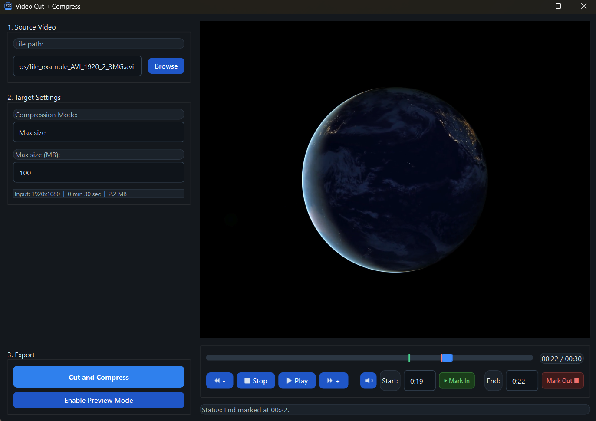

# Video Cut + Compress

Simple Windows desktop app to cut, preview, and compress videos with FFmpeg through a clean Qt interface.

  

## Install

1. Download [`VideoCutCompress-Setup.exe`](https://github.com/SuicidaI-Idol/videocutandcompress/releases/latest/download/VideoCutCompress-Setup.exe).
2. Run the installer.
3. Launch **Video Cut and Compress** from the Start menu or desktop shortcut.

## Features

- Video playback with seek bar and relative skip controls
- `Start` and `End` trim markers displayed on the timeline
- Toggleable preview mode for virtual segment playback
- Output folder shortcut after a successful export
- Three export modes:
- `Max size`: compress to a target file size in MB
- `Preset (editable)`: use customizable bitrate and width settings
- `Input (cut only)`: cut the selected segment without recompression

## Requirements

- Windows
- FFmpeg is bundled in the installer
- No manual Qt DLL setup required after installation

## Output

Exported files are created next to the original video with an auto-generated name based on:

- source file name
- start / end time
- selected export mode
