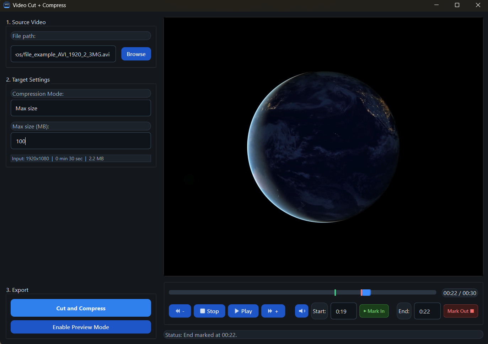

# Video Cut + Compress

Simple Windows desktop app to cut, preview, and compress videos with FFmpeg through a clean Qt interface.

<p align="center">
  
</p>

## Install

1. Download [`VideoCutCompress-Setup.exe`](https://github.com/SuicidaI-Idol/videocutandcompress/raw/main/dist/VideoCutCompress-Setup.exe).
2. Run the installer.
3. Launch **Video Cut and Compress** from the Start menu or desktop shortcut.

## Features

- Video loading with the file picker or drag and drop, including directly on
  the video area
- Video playback with seek bar and relative skip controls
- Interactive rectangular crop selection
- Live preview that displays only the selected crop and scales it smoothly to
  the available preview area
- Crop dimensions and position displayed in source-video pixels
- `Reset crop` action to restore the complete frame
- `Start` and `End` trim markers displayed on the timeline
- Toggleable preview mode for virtual segment playback
- Output folder shortcut after a successful export
- Three export modes:

  - `Max size`: compress to a target file size in MB
  - `Preset (editable)`: use customizable bitrate and width settings
  - `Input (cut only)`: cut the selected segment without recompression; the
    video is re-encoded only when a crop is active

### Cropping a video

1. Load a video.
2. Select `Select crop`.
3. Drag a rectangle over the part of the full frame to keep.
4. Release the mouse button. The preview then displays only that area.
5. Select `Select crop` again to replace the selection, or `Reset crop` to
   restore the full frame.

The crop uses the source-video coordinates shown beside the crop controls and
is applied to every export mode through FFmpeg.

## Requirements

- Windows
- FFmpeg is bundled in the installer
- No manual Qt DLL setup required after installation

## Development and complete installer build

The VS Code configuration uses environment variables instead of machine-specific
Qt paths. Define them for your Qt installation, then restart VS Code:

```powershell
setx QT_SDK_DIR "C:\Qt\6.11.1\mingw_64"
setx QT_MINGW_DIR "C:\Qt\Tools\mingw1310_64"
setx QT_CMAKE_DIR "C:\Qt\Tools\CMake_64"
setx QT_NINJA_DIR "C:\Qt\Tools\Ninja"
```

Qt 6.8 or newer is required with Widgets, Multimedia, and MultimediaWidgets.
The release workflow also requires:

- `ffmpeg.exe` and `ffprobe.exe` in `.cache/ffmpeg/bin`
- Inno Setup 6 installed in one of the standard locations detected by
  `scripts/build-installer.ps1`

To build and debug the application, press `F5` in VS Code.

To rebuild the application, deploy all Qt and MinGW runtime dependencies, copy
FFmpeg, and generate the complete installer:

1. Open **Terminal > Run Task...** in VS Code.
2. Run **Build Installer (Release)**.
3. Wait for every dependent task to finish.

This task performs the complete sequence:

1. Removes the previous `build-release` directory.
2. Configures and compiles a fresh Release build with CMake and Ninja.
3. Runs `windeployqt` to copy the required Qt and compiler runtime files.
4. Copies `ffmpeg.exe` and `ffprobe.exe` into the release directory.
5. Removes the CMake build metadata that should not be distributed.
6. Invokes Inno Setup to create `dist/VideoCutCompress-Setup.exe`.

The resulting standalone application is `build-release/videocut.exe`, and the
installer to distribute is `dist/VideoCutCompress-Setup.exe`.

## Output

Exported files are created next to the original video with an auto-generated name based on:

- source file name
- start / end time
- selected export mode
